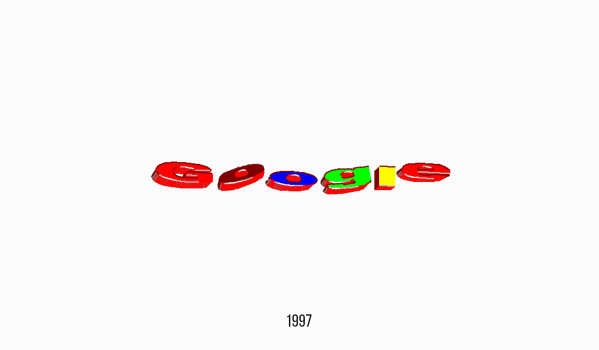

# <!-- fit --> PageRank Simulation and Calculation
<br />


---

## The PageRank Problem


---

## The PageRank Problem<br />


Part of the Google's search algorithm since the company's existence

Assume web pages with more hyperlinks from high-rank pages should rank higher

---

#### page
Short for web page
#### link
Short for hyperlink. The total number of links page $x$ has is denoted as $d(x)$ because it is equivalent to degree of vertex
#### PageRank $\pi$
A way to estimate the importance of a page.
The PageRank of one page is recursively defined as the sum of the PageRanks of the prior pages leading to it divided by their degrees. The total PageRank usually sums to a constant $1$.
$$
\pi_y=\sum_{x\longrightarrow y}\frac{\pi_x}{d(x)}
$$

---

### Translation into Markov chain
- page $\rightarrow$ state

- link $\rightarrow$ all the pages linked to have an equal probability
pages not linked have a probability $0$
$$
p_{x,y}=\begin{cases}
    \frac{1}{d(x)}*&x\longrightarrow y\\[6pt]
    0&\text{otherwise}
    \end{cases}
$$

- PageRank $\rightarrow$ stationary distribution*

---

## Getting the data


Data are obtained using a python crawler `Scrapy`
Scrapy downloads the entire page and filter out its links
and then do so to the pages in the links

---

## Data to be analyzed


---


## Data to be analyzed
Intersection's $19$ test webpages<br />

<p style="line-height:0.5;color:gray">
<font size="1">https://sites.duke.edu/intersections<br />
https://sites.duke.edu/intersections/2021/03/05/suibian-from-ice-cream-brand-to-chinese-cultural-value<br />
https://sites.duke.edu/intersections/2021/03/13/the-mysterious-world-of-jianghu<br />
https://sites.duke.edu/intersections/2021/03/22/it-must-be-yuanfen<br />
https://sites.duke.edu/intersections/2021/04/29/jiangjiu-the-chinese-way-of-taking-care<br />
https://sites.duke.edu/intersections/2021/09/04/jiayou-a-message-of-encouragement-for-everybody<br />
https://sites.duke.edu/intersections/2021/10/12/relearning-my-native-language<br />
https://sites.duke.edu/intersections/2021/10/26/the-how-and-why-of-cram-schools-in-china<br />
https://sites.duke.edu/intersections/2021/11/22/dont-learn-language-by-rote-anymore<br />
https://sites.duke.edu/intersections/about-2<br />
https://sites.duke.edu/intersections/category/cultures-explained<br />
https://sites.duke.edu/intersections/category/interviews<br />
https://sites.duke.edu/intersections/category/multilingual<br />
https://sites.duke.edu/intersections/category/only-here<br />
https://sites.duke.edu/intersections/category/personal-history<br />
https://sites.duke.edu/intersections/category/the-big-idea<br />
https://sites.duke.edu/intersections/category/vocabulary-lessons<br />
https://sites.duke.edu/intersections/page/2<br />
https://sites.duke.edu/intersections/submissions-2</font>
</p>

---

### Transition Matrix
<br />

$$
\begin{bmatrix}
\frac{1}{18} & 0 & \frac{1}{18} & \frac{1}{18} & \frac{1}{18} & \frac{1}{18} & \frac{1}{18} & \frac{1}{18} & \frac{1}{18} & \frac{1}{18} & \frac{1}{18} & \frac{1}{18} & \frac{1}{18} & \frac{1}{18} & \frac{1}{18} & \frac{1}{18} & \frac{1}{18} & \frac{1}{18} & \frac{1}{18}\\[12pt]\frac{1}{9} & \frac{1}{9} & 0 & 0 & 0 & 0 & 0 & 0 & 0 & \frac{1}{9} & \frac{1}{9} & 0 & 0 & \frac{1}{9} & \frac{1}{9} & \frac{1}{9} & \frac{1}{9} & 0 & \frac{1}{9}\\[12pt]\frac{1}{9} & 0 & \frac{1}{9} & 0 & 0 & 0 & 0 & 0 & 0 & \frac{1}{9} & \frac{1}{9} & 0 & 0 & \frac{1}{9} & \frac{1}{9} & \frac{1}{9} & \frac{1}{9} & 0 & \frac{1}{9}\\[12pt]\frac{1}{9} & 0 & 0 & \frac{1}{9} & 0 & 0 & 0 & 0 & 0 & \frac{1}{9} & \frac{1}{9} & 0 & 0 & \frac{1}{9} & \frac{1}{9} & \frac{1}{9} & \frac{1}{9} & 0 & \frac{1}{9}\\[12pt]\frac{1}{9} & 0 & 0 & 0 & \frac{1}{9} & 0 & 0 & 0 & 0 & \frac{1}{9} & \frac{1}{9} & 0 & 0 & \frac{1}{9} & \frac{1}{9} & \frac{1}{9} & \frac{1}{9} & 0 & \frac{1}{9}\\[12pt]\frac{1}{9} & 0 & 0 & 0 & 0 & \frac{1}{9} & 0 & 0 & 0 & \frac{1}{9} & \frac{1}{9} & 0 & 0 & \frac{1}{9} & \frac{1}{9} & \frac{1}{9} & \frac{1}{9} & 0 & \frac{1}{9}\\[12pt]\frac{1}{9} & 0 & 0 & 0 & 0 & 0 & \frac{1}{9} & 0 & 0 & \frac{1}{9} & \frac{1}{9} & 0 & 0 & \frac{1}{9} & \frac{1}{9} & \frac{1}{9} & \frac{1}{9} & 0 & \frac{1}{9}\\[12pt]\frac{1}{9} & 0 & 0 & 0 & 0 & 0 & 0 & \frac{1}{9} & 0 & \frac{1}{9} & \frac{1}{9} & 0 & 0 & \frac{1}{9} & \frac{1}{9} & \frac{1}{9} & \frac{1}{9} & 0 & \frac{1}{9}\\[12pt]\frac{1}{9} & 0 & 0 & 0 & 0 & 0 & 0 & 0 & \frac{1}{9} & \frac{1}{9} & \frac{1}{9} & 0 & 0 & \frac{1}{9} & \frac{1}{9} & \frac{1}{9} & \frac{1}{9} & 0 & \frac{1}{9}\\[12pt]\frac{1}{8} & 0 & 0 & 0 & 0 & 0 & 0 & 0 & 0 & \frac{1}{8} & \frac{1}{8} & 0 & 0 & \frac{1}{8} & \frac{1}{8} & \frac{1}{8} & \frac{1}{8} & 0 & \frac{1}{8}\\[12pt]\frac{1}{10} & 0 & 0 & 0 & 0 & 0 & 0 & \frac{1}{10} & 0 & \frac{1}{10} & \frac{1}{10} & \frac{1}{10} & 0 & \frac{1}{10} & \frac{1}{10} & \frac{1}{10} & \frac{1}{10} & 0 & \frac{1}{10}\\[12pt]\frac{1}{9} & 0 & 0 & 0 & 0 & 0 & 0 & 0 & 0 & \frac{1}{9} & \frac{1}{9} & \frac{1}{9} & 0 & \frac{1}{9} & \frac{1}{9} & \frac{1}{9} & \frac{1}{9} & 0 & \frac{1}{9}\\[12pt]\frac{1}{9} & 0 & 0 & 0 & 0 & 0 & 0 & 0 & 0 & \frac{1}{9} & \frac{1}{9} & 0 & \frac{1}{9} & \frac{1}{9} & \frac{1}{9} & \frac{1}{9} & \frac{1}{9} & 0 & \frac{1}{9}\\[12pt]\frac{1}{9} & 0 & 0 & 0 & 0 & 0 & 0 & 0 & 0 & \frac{1}{9} & \frac{1}{9} & 0 & \frac{1}{9} & \frac{1}{9} & \frac{1}{9} & \frac{1}{9} & \frac{1}{9} & 0 & \frac{1}{9}\\[12pt]\frac{1}{9} & 0 & 0 & 0 & 0 & 0 & \frac{1}{9} & 0 & 0 & \frac{1}{9} & \frac{1}{9} & 0 & 0 & \frac{1}{9} & \frac{1}{9} & \frac{1}{9} & \frac{1}{9} & 0 & \frac{1}{9}\\[12pt]\frac{1}{9} & 0 & 0 & 0 & 0 & 0 & 0 & 0 & \frac{1}{9} & \frac{1}{9} & \frac{1}{9} & 0 & 0 & \frac{1}{9} & \frac{1}{9} & \frac{1}{9} & \frac{1}{9} & 0 & \frac{1}{9}\\[12pt]\frac{1}{13} & \frac{1}{13} & \frac{1}{13} & \frac{1}{13} & \frac{1}{13} & \frac{1}{13} & 0 & 0 & 0 & \frac{1}{13} & \frac{1}{13} & 0 & 0 & \frac{1}{13} & \frac{1}{13} & \frac{1}{13} & \frac{1}{13} & 0 & \frac{1}{13}\\[12pt]\frac{1}{10} & \frac{1}{10} & 0 & 0 & 0 & 0 & 0 & 0 & 0 & \frac{1}{10} & \frac{1}{10} & 0 & 0 & \frac{1}{10} & \frac{1}{10} & \frac{1}{10} & \frac{1}{10} & \frac{1}{10} & \frac{1}{10}\\[12pt]\frac{1}{8} & 0 & 0 & 0 & 0 & 0 & 0 & 0 & 0 & \frac{1}{8} & \frac{1}{8} & 0 & 0 & \frac{1}{8} & \frac{1}{8} & \frac{1}{8} & \frac{1}{8} & 0 & \frac{1}{8}
\end{bmatrix}
$$

---

### \* notice that
- Every page has a link to the main page
- Every page has at least one link

$\Rightarrow$
- All the states are recurrent
- All the states are in the same closed class (irreducible)
- The chain is aperiodic

---

### <span style="color:gray">Translation into Markov chain</span>
- <span style="color:gray">page $\rightarrow$ state</span>

- <span style="color:gray">link $\rightarrow$ all the pages linked to have an equal probability
pages not linked have a probability $0$</span>
$$
p_{x,y}=\begin{cases}
    \frac{1}{d(x)}&x\longrightarrow y\\[6pt]
    0&\text{otherwise}
    \end{cases}
$$
<span style="color:blue">         because $d(x)\neq0\quad\forall\ x$</span>
<br />

- PageRank $\rightarrow$ stationary distribution
<span style="color:blue">because the chain is irreducible and aperiodic</span>

---

## Method 1: Random Surfer 🏄🏻‍♂️
<br />

$\qquad\approx$ Random walker

---

### The *Random Surfer* Model
<br />

- The surfer goes to a random page with probability 0.1, or click a hyperlink in the current page with probability 0.9
- The probability to click any of the $k$ hyperlinks are equal ($\frac{1}{k}$)
for a total number of $n$ pages
<br />

$$
p_{x,y}=\begin{cases}
    0.1\frac{1}{n}&\forall\ y\\
    \quad+ \\
    0.9\frac{1}{d(x)}&\forall\ y\in\text{ one for the links}
    \end{cases}
$$

---

### Principle
<br />

- 
$$
\text{Frequency} \rightarrow \text{Probability}\\[6pt] \text{as } t\rightarrow\infty\ \ \ \ 
$$
for the surfer to reach any pages
- The pseudo-random number generated by computers can approximate real random when repeated for many times

---

### Adjust raw data for predicted frequency
<br />

Every time, here is a base probability $0.1\frac{1}{n}$ that a page gets reached no matter what
<br />

$$
\text{raw }=0.1\frac{1}{n}+0.9\text{ adj}\\[12pt]
\Rightarrow\text{adj }=\frac{10}{9}\text{raw}-\frac{1}{9}\frac{1}{n}
$$

---

### Result: $2^{20}$ steps
$$
\begin{array}{|c|c|c|c|c|}
    \text{index} & \text{arrival} & \text{raw} & \text{adj} & \text{url}\\[12pt]
    11 & 103895 & 0.099 & 0.104&\text{https://sites.duke.edu/intersections/category/cultures-explained}\\[12pt]
    14 & 103734 & 0.099 & 0.104&\text{https://sites.duke.edu/intersections/category/only-here}\\[12pt]
    1 & 103559 & 0.099 & 0.104&\text{https://sites.duke.edu/intersections}\\[12pt]
    17 & 103544 & 0.099 & 0.104&\text{https://sites.duke.edu/intersections/category/vocabulary-lessons}\\[12pt]
    19 & 103471 & 0.099 & 0.104&\text{https://sites.duke.edu/intersections/submissions-2}\\[12pt]
    15 & 103459 & 0.099 & 0.104&\text{https://sites.duke.edu/intersections/category/personal-history}\\[12pt]
    10 & 102800 & 0.098 & 0.103&\text{https://sites.duke.edu/intersections/about-2}\\[12pt]
    16 & 102689 & 0.098 & 0.103&\text{https://sites.duke.edu/intersections/category/the-big-idea}\\[12pt]
    9 & 23541 & 0.022 & 0.019&\text{https://sites.duke.edu/intersections/2021/11/22/dont-learn-language-by-rote-anymore}\\[12pt]
    7 & 23416 & 0.022 & 0.019&\text{https://sites.duke.edu/intersections/2021/10/12/relearning-my-native-language}\\[12pt]
    13 & 23412 & 0.022 & 0.019&\text{https://sites.duke.edu/intersections/category/multilingual}\\[12pt]
    8 & 22342 & 0.021 & 0.018&\text{https://sites.duke.edu/intersections/2021/10/26/the-how-and-why-of-cram-schools-in-china}\\[12pt]
    12 & 22064 & 0.021 & 0.018&\text{https://sites.duke.edu/intersections/category/interviews}\\[12pt]
    4 & 20117 & 0.019 & 0.015&\text{https://sites.duke.edu/intersections/2021/03/22/it-must-be-yuanfen}\\[12pt]
    6 & 19980 & 0.019 & 0.015&\text{https://sites.duke.edu/intersections/2021/09/04/jiayou-a-message-of-encouragement-for-everybody}\\[12pt]
    5 & 19841 & 0.019 & 0.015&\text{https://sites.duke.edu/intersections/2021/04/29/jiangjiu-the-chinese-way-of-taking-care}\\[12pt]
    3 & 19746 & 0.019 & 0.015&\text{https://sites.duke.edu/intersections/2021/03/13/the-mysterious-world-of-jianghu}\\[12pt]
    2 & 15156 & 0.014 & 0.010&\text{https://sites.duke.edu/intersections/2021/03/05/suibian-from-ice-cream-brand-to-chinese-cultural-value}\\[12pt]
    18 & 11810 & 0.011 & 0.007&\text{https://sites.duke.edu/intersections/page/2}
    \end{array}
$$

---

## Method 2: Probability Iteration

---

### Principle
<br />

Assume that the Markov chain is aperiodic and has a stationary distribution $\pi$, then
$$
\lim_{n\rightarrow\infty}P(X_n=y)=\pi(y)\qquad\forall\ y\in S
$$
For any initial distribution, the distribution goes to $\pi$ after infinite steps

---

## Method 2: Probability Iteration
<br />

$$
\text{Start from an equal probability }\frac{1}{n}\\[12pt]
P(X_{n+1}=y)=\sum_xp_{x,y}P(X_n=x)
$$

---

### Result: $2^9$ iterations

$$
\begin{array}{|c|c|c|}
\text{index} & \text{PageRank}&\text{url}\\[12pt]
1 & 0.103&\text{https://sites.duke.edu/intersections}\\[12pt]
10 & 0.103&\text{https://sites.duke.edu/intersections/about-2}\\[12pt]
11 & 0.103&\text{https://sites.duke.edu/intersections/category/cultures-explained}\\[12pt]
14 & 0.103&\text{https://sites.duke.edu/intersections/category/only-here}\\[12pt]
15 & 0.103&\text{https://sites.duke.edu/intersections/category/personal-history}\\[12pt]
16 & 0.103&\text{https://sites.duke.edu/intersections/category/the-big-idea}\\[12pt]
17 & 0.103&\text{https://sites.duke.edu/intersections/category/vocabulary-lessons}\\[12pt]
19 & 0.103&\text{https://sites.duke.edu/intersections/submissions-2}\\[12pt]
7 & 0.019&\text{https://sites.duke.edu/intersections/2021/10/12/relearning-my-native-language}\\[12pt]
9 & 0.019&\text{https://sites.duke.edu/intersections/2021/11/22/dont-learn-language-by-rote-anymore}\\[12pt]
13 & 0.019&\text{https://sites.duke.edu/intersections/category/multilingual}\\[12pt]
8 & 0.018&\text{https://sites.duke.edu/intersections/2021/10/26/the-how-and-why-of-cram-schools-in-china}\\[12pt]
12 & 0.018&\text{https://sites.duke.edu/intersections/category/interviews}\\[12pt]
3 & 0.015&\text{https://sites.duke.edu/intersections/2021/03/13/the-mysterious-world-of-jianghu}\\[12pt]
4 & 0.015&\text{https://sites.duke.edu/intersections/2021/03/22/it-must-be-yuanfen}\\[12pt]
5 & 0.015&\text{https://sites.duke.edu/intersections/2021/04/29/jiangjiu-the-chinese-way-of-taking-care}\\[12pt]
6 & 0.015&\text{https://sites.duke.edu/intersections/2021/09/04/jiayou-a-message-of-encouragement-for-everybody}\\[12pt]
2 & 0.010&\text{https://sites.duke.edu/intersections/2021/03/05/suibian-from-ice-cream-brand-to-chinese-cultural-value}\\[12pt]
18 & 0.006&\text{https://sites.duke.edu/intersections/page/2}
    \end{array}
$$

---

## Method 3: $\\$Solving the System of Linear Equations

---

## Method 3: $\\$Solving the System of Linear Equations
<br />

$$
\begin{cases}
    \pi(y)=\sum_x\pi(x)p_{x,y}\quad\forall\ y\\
    \sum_x\pi(x)=1
\end{cases}\\[12pt]
\Rightarrow\begin{bmatrix}
    p_{1,1}-1&p_{2,1}&\cdots&p_{n,1}\\
    p_{1,2}&p_{2,2}-1&\cdots&p_{n,2}\\
    \vdots\\
    p_{1,n-1}&p_{2,n-1}&\cdots&p_{n-1,n-1}-1\\
    1&\cdots&&1
\end{bmatrix}
\begin{bmatrix}
    \pi_1\\
    \pi_2\\
    \vdots\\
    \pi_{n}\\
\end{bmatrix}
=\begin{bmatrix}
    0\\
    \vdots\\
    0\\
    1\\
\end{bmatrix}
$$

---

$$
A\vec{\pi}=B\\[12pt]
\begin{bmatrix}
-\frac{17}{18}&\frac{1}{11}&\frac{1}{11}&\frac{1}{11}&\frac{1}{11}&\frac{1}{11}&\frac{1}{11}&\frac{1}{11}&\frac{1}{11}&\frac{1}{8}&\frac{1}{10}&\frac{1}{11}&\frac{1}{11}&\frac{1}{11}&\frac{1}{11}&\frac{1}{11}&\frac{1}{13}&\frac{1}{10}&\frac{1}{8}\\[6pt]
0&-\frac{8}{9}&0&0&0&0&0&0&0&0&0&0&0&0&0&0&\frac{1}{13}&\frac{1}{10}&0\\[6pt]
\frac{1}{18}&0&-\frac{8}{9}&0&0&0&0&0&0&0&0&0&0&0&0&0&\frac{1}{13}&0&0\\[6pt]
\frac{1}{18}&0&0&-\frac{8}{9}&0&0&0&0&0&0&0&0&0&0&0&0&\frac{1}{13}&0&0\\[6pt]
\frac{1}{18}&0&0&0&-\frac{8}{9}&0&0&0&0&0&0&0&0&0&0&0&\frac{1}{13}&0&0\\[6pt]
\frac{1}{18}&0&0&0&0&-\frac{8}{9}&0&0&0&0&0&0&0&0&0&0&\frac{1}{13}&0&0\\[6pt]
\frac{1}{18}&0&0&0&0&0&-\frac{8}{9}&0&0&0&0&0&0&0&\frac{1}{11}&0&0&0&0\\[6pt]
\frac{1}{18}&0&0&0&0&0&0&-\frac{8}{9}&0&0&\frac{1}{10}&0&0&0&0&0&0&0&0\\[6pt]
\frac{1}{18}&0&0&0&0&0&0&0&-\frac{8}{9}&0&0&0&0&0&0&\frac{1}{11}&0&0&0\\[6pt]
\frac{1}{18}&\frac{1}{11}&\frac{1}{11}&\frac{1}{11}&\frac{1}{11}&\frac{1}{11}&\frac{1}{11}&\frac{1}{11}&\frac{1}{11}&-\frac{7}{8}&\frac{1}{10}&\frac{1}{11}&\frac{1}{11}&\frac{1}{11}&\frac{1}{11}&\frac{1}{11}&\frac{1}{13}&\frac{1}{10}&\frac{1}{8}\\[6pt]
\frac{1}{18}&\frac{1}{11}&\frac{1}{11}&\frac{1}{11}&\frac{1}{11}&\frac{1}{11}&\frac{1}{11}&\frac{1}{11}&\frac{1}{11}&\frac{1}{8}&-\frac{9}{10}&\frac{1}{11}&\frac{1}{11}&\frac{1}{11}&\frac{1}{11}&\frac{1}{11}&\frac{1}{13}&\frac{1}{10}&\frac{1}{8}\\[6pt]
\frac{1}{18}&0&0&0&0&0&0&0&0&0&\frac{1}{10}&-\frac{8}{9}&0&0&0&0&0&0&0\\[6pt]
\frac{1}{18}&0&0&0&0&0&0&0&0&0&0&0&-\frac{8}{9}&\frac{1}{11}&0&0&0&0&0\\[6pt]
\frac{1}{18}&\frac{1}{11}&\frac{1}{11}&\frac{1}{11}&\frac{1}{11}&\frac{1}{11}&\frac{1}{11}&\frac{1}{11}&\frac{1}{11}&\frac{1}{8}&\frac{1}{10}&\frac{1}{11}&\frac{1}{11}&-\frac{8}{9}&\frac{1}{11}&\frac{1}{11}&\frac{1}{13}&\frac{1}{10}&\frac{1}{8}\\[6pt]
\frac{1}{18}&\frac{1}{11}&\frac{1}{11}&\frac{1}{11}&\frac{1}{11}&\frac{1}{11}&\frac{1}{11}&\frac{1}{11}&\frac{1}{11}&\frac{1}{8}&\frac{1}{10}&\frac{1}{11}&\frac{1}{11}&\frac{1}{11}&-\frac{8}{9}&\frac{1}{11}&\frac{1}{13}&\frac{1}{10}&\frac{1}{8}\\[6pt]
\frac{1}{18}&\frac{1}{11}&\frac{1}{11}&\frac{1}{11}&\frac{1}{11}&\frac{1}{11}&\frac{1}{11}&\frac{1}{11}&\frac{1}{11}&\frac{1}{8}&\frac{1}{10}&\frac{1}{11}&\frac{1}{11}&\frac{1}{11}&\frac{1}{11}&-\frac{8}{9}&\frac{1}{13}&\frac{1}{10}&\frac{1}{8}\\[6pt]
\frac{1}{18}&\frac{1}{11}&\frac{1}{11}&\frac{1}{11}&\frac{1}{11}&\frac{1}{11}&\frac{1}{11}&\frac{1}{11}&\frac{1}{11}&\frac{1}{8}&\frac{1}{10}&\frac{1}{11}&\frac{1}{11}&\frac{1}{11}&\frac{1}{11}&\frac{1}{11}&-\frac{12}{13}&\frac{1}{10}&\frac{1}{8}\\[6pt]
\frac{1}{18}&0&0&0&0&0&0&0&0&0&0&0&0&0&0&0&0&-\frac{9}{10}&0\\[6pt]
1&1&1&1&1&1&1&1&1&1&1&1&1&1&1&1&1&1&1
\end{bmatrix}
\begin{bmatrix}
    \pi_1\\
    \pi_2\\
    \vdots\\
    \pi_{22}\\
\end{bmatrix}
=\begin{bmatrix}
0\\
0\\
0\\
0\\
0\\
0\\
0\\
0\\
0\\
0\\
0\\
0\\
0\\
0\\
0\\
0\\
0\\
0\\
1\\
\end{bmatrix}
$$

---

### The real process in the computer
First transverse $p$, subtract identity matrix $I$, and replace the last row with $\vec{1}$ through iteration
$$
A=((p-I)_{n\vec{1}})^T
$$
Calculate the inverse of $A$ and right multiply it by $B$
$$
\vec{\pi}=A^{-1}B
$$
Therefore $A$ has to be invertible

---

### Result: linear algebra
<br />

$$
\vec{\pi}
=\begin{bmatrix}
    0.10347827\\[6pt]
    0.00967345\\[6pt]
    0.01542224\\[6pt]
    0.01542224\\[6pt]
    0.01542224\\[6pt]
    0.01542224\\[6pt]
    0.01940217\\[6pt]
    0.01810870\\[6pt]
    0.01940217\\[6pt]
    0.10347827\\[6pt]
    0.10347827\\[6pt]
    0.01810870\\[6pt]
    0.01940217\\[6pt]
    0.10347827\\[6pt]
    0.10347827\\[6pt]
    0.10347827\\[6pt]
    0.10347827\\[6pt]
    0.00638755\\[6pt]
    0.10347827
    \end{bmatrix}
\quad\Rightarrow\qquad
\begin{array}{|c|c|c|}
    \text{index}&\pi_i&\text{url}\\[6pt]
    1&0.10347827&\text{https://sites.duke.edu/intersections}\\[6pt]
    10&0.10347827&\text{https://sites.duke.edu/intersections/about-2}\\[6pt]
    11&0.10347827&\text{https://sites.duke.edu/intersections/category/cultures-explained}\\[6pt]
    14&0.10347827&\text{https://sites.duke.edu/intersections/category/only-here}\\[6pt]
    15&0.10347827&\text{https://sites.duke.edu/intersections/category/personal-history}\\[6pt]
    16&0.10347827&\text{https://sites.duke.edu/intersections/category/the-big-idea}\\[6pt]
    17&0.10347827&\text{https://sites.duke.edu/intersections/category/vocabulary-lessons}\\[6pt]
    19&0.10347827&\text{https://sites.duke.edu/intersections/submissions-2}\\[6pt]
    7&0.01940217&\text{https://sites.duke.edu/intersections/2021/10/12/relearning-my-native-language}\\[6pt]
    9&0.01940217&\text{https://sites.duke.edu/intersections/2021/11/22/dont-learn-language-by-rote-anymore}\\[6pt]
    13&0.01940217&\text{https://sites.duke.edu/intersections/category/multilingual}\\[6pt]
    8&0.01810870&\text{https://sites.duke.edu/intersections/2021/10/26/the-how-and-why-of-cram-schools-in-china}\\[6pt]
    12&0.01810870&\text{https://sites.duke.edu/intersections/category/interviews}\\[6pt]
    3&0.01542224&\text{https://sites.duke.edu/intersections/2021/03/13/the-mysterious-world-of-jianghu}\\[6pt]
    4&0.01542224&\text{https://sites.duke.edu/intersections/2021/03/22/it-must-be-yuanfen}\\[6pt]
    5&0.01542224&\text{https://sites.duke.edu/intersections/2021/04/29/jiangjiu-the-chinese-way-of-taking-care}\\[6pt]
    6&0.01542224&\text{https://sites.duke.edu/intersections/2021/09/04/jiayou-a-message-of-encouragement-for-everybody}\\[6pt]
    2&0.00967345&\text{https://sites.duke.edu/intersections/2021/03/05/suibian-from-ice-cream-brand-to-chinese-cultural-value}\\[6pt]
    18&0.00638755&\text{https://sites.duke.edu/intersections/page/2}
    \end{array}
$$


---

## Difficulties and thoughts
#### Pages that lead to nowhere
- Crash the iterate program
```zsh
Traceback (most recent call last):
  File "/Users/sichanghe/Desktop/STATS 210/presentation/iterate-method.py", line 48, in <module>
    s += trans[x][y]*b[x]
IndexError: list index out of range
```

- If assume lead to themselves, cause a high PageRank

<span style="color:blue">Turns out to be a failure when crawling the webpage</span>

---

## Ranking the DKU website


---

**DISCLAIMER**
<br />

This is not PhotoShop magic
The screenshot is taken from
<p style="line-height:0.5;color:gray">
<font size="1">https://dukekunshan.edu.cn/en/node/1/node/node/node/node/node/node/node/node/node/node/node/node/node/node/node/node/node/node/node/node/node/node/node/node/node/node/node/node/node/node/node/node/node/node/node/node/node/node/node/node/node/node/node/node/node/node/node/node/node/node/node/node/node/node/node/node/node/node/node/node/node/node/node/node/node/node/node/node/node/node/node/node/node/node/node/node/node/node/node/node/node/node/node/node/node/node/node/node/node/node/node/node/node/node/node/node/node/node/node/node/node/node/node/node/node/node/node/node/node/node/node/node/node/node/node/node/node/node/node/node/node/node/node/node/node/node/node/node/node/node/node/node/node/node/node/node/node/node/node/node/node/node/node/node/node/node/node/node/node/node/node/node/node/node/node/node/node/node/node/node/node/node/node/node/node/node/node/node/node/node/node/node/node/node/node/node/node/node/node/node/node/node/node/node/node/node/node/node/node/node/node/node/node/node/node/node/node/node/node/node/node/node/node/node/node/node/node/node/node/node/node/node/node/node/node/node/node/node/node/node/node/node/node/node/node/node/node/node/node/node/node/node/node/node/node/node/node/node/node/node/node/node/node/node/node/node/node/node/node/node/node/node/node/node/node/node/node/node/node/node/node/node/node/node/node/node/node/node/node/node/node/node/node/node/node/node/node/node/node/node/node/node/node/node/node/node/node/node/node/node/node/node/node/node/node/node/node/node/node/node/node/node/node/node/node/node/node/node/node/node/node/node/node/node/node/node/node/node/node/node/node/node/node/node/node/node/node/node/node/node/node/node/node/node/node/node/node/node/node/node/node/node/node/node/node/node/node/node/node/node/node/node/node/node/node/node/node/node/node/node/node/node/node/node/node/node/node/node/node/node/node/node/node/node/node/node/node/node/node/node/node/node/node/node/node/node/node/node/node/node/node/node/node/node/node/node/node/node/node/node/node/node/node/node/node/node/node/node/node/node/node/node/node/node/node/node/node/node/node/node/node/node/node/node/node/node/node/node/node/node/node/node/node/node/node/node/node/node/node/node/node/node/node/node/node/node/node/node/node/node/node/node/node/node/node/node/node/node/node/node/node/node/node/node/node/node/node/node/node/node/node/node/node/node/node/node/node/node/node/node/node/node/node/node/node/node/node/node/node/node/node/node/node/node/node/node/node/node/node/node/node/node/node/node/node/node/node/node/node/node/node/node/node/node/node/node/node/node/node/node/node/node/node/node/node/node/node/node/node/node/node/node/node/node/node/node/node/node/node/node/node/node/node/node/node/node/node/node/node/node/node/node/node/node/node/node/node/node/node/node/node/node/node/node/node/node/node/node/node/node/node/node/node/node/node/node/node/node/node/node/node/node/node/node/node/node/node/node/node/node/node/node/node/node/node/node/node/node/node/node/node/node/node/node/node/node/node/node/node/node/node/node/node/node/node/node/node/node/node/node/node/node/node/node/node/node/node/node/node/node/node/node/node/node/node/node/node/node/node/node/node/node/node/node/node/node/node/node/node/node/node/node/node/node/node/node/node/node/node/node/node/node/node/node/node/node/node/node/node/node/node/node/node/node/node/node/node/node/node/node/node/node/node/node/node/node/node/node/node/node/node/node/node/node/node/node/node/node/node/node/node/node/node/node/node/node/node/node/node/node/node/node/node/node/node/node/node/node/node/node/node/node/node/node/node/node/node/node/node/node/node/node/node/node/node/node/node/node/node/node/node/node/node/node/node/node/node/node/node/node/node/node/node/node/node/node/node/node/node/node/node/node/node/node/node/node/node/node/node/node/node/node/node/node/node/node/node/node/node/node/node/node/node/node/node/node/node/node/node/node/node/node/node/node/node/node/node/node/node/node/node/node/node/node/node/node/node/node/node/node/node/node</font>
</p>

---

### Treating the pages in DKU website
<br />

- Pages with url that contains `/node` are banned
- everything in the url after `#` are ignored
- calendars (e.g. `…/2018-09`) are banned
- pages that return no links are ignored
- redirection is banned

---

### Raw data
$$
\begin{bmatrix}
\frac{1}{92}&\frac{1}{92}&0&0&0&0&0&0&0&0&\frac{1}{92}&\frac{1}{92}&0&0&0&0&0&0&0&0&\cdots\\[6pt]
\frac{1}{92}&\frac{1}{92}&0&0&0&0&0&0&0&0&\frac{1}{92}&\frac{1}{92}&0&0&0&0&0&0&0&0&\cdots\\[6pt]
\frac{1}{94}&\frac{1}{94}&\frac{1}{94}&0&0&0&0&0&0&0&0&0&0&0&0&0&0&0&0&0&\cdots\\[6pt]
\frac{1}{95}&\frac{1}{95}&\frac{1}{95}&\frac{1}{95}&0&0&0&0&0&0&0&0&0&0&0&0&0&0&0&0&\cdots\\[6pt]
\frac{1}{94}&\frac{1}{94}&0&0&\frac{1}{94}&0&0&0&0&0&0&0&0&0&0&0&0&0&0&0&\cdots\\[6pt]
\frac{1}{95}&\frac{1}{95}&0&0&\frac{1}{95}&\frac{1}{95}&0&0&0&0&0&0&0&0&0&0&0&0&0&0&\cdots\\[6pt]
\frac{1}{68}&\frac{1}{68}&0&0&0&0&\frac{1}{68}&0&0&0&0&0&0&0&0&0&0&0&0&0&\cdots\\[6pt]
\frac{1}{69}&\frac{1}{69}&0&0&0&0&\frac{1}{69}&\frac{1}{69}&0&0&0&0&0&0&0&0&0&0&0&0&\cdots\\[6pt]
\frac{1}{94}&\frac{1}{94}&0&0&0&0&0&0&\frac{1}{94}&0&0&0&0&0&0&0&0&0&0&0&\cdots\\[6pt]
\frac{1}{95}&\frac{1}{95}&0&0&0&0&0&0&\frac{1}{95}&\frac{1}{95}&0&0&0&0&0&0&0&0&0&0&\cdots\\[6pt]
\frac{1}{68}&\frac{1}{68}&0&0&0&0&0&0&0&0&\frac{1}{68}&0&0&0&0&0&0&0&0&0&\cdots\\[6pt]
\frac{1}{69}&\frac{1}{69}&0&0&0&0&0&0&0&0&\frac{1}{69}&\frac{1}{69}&0&0&0&0&0&0&0&0&\cdots\\[6pt]
\frac{1}{66}&\frac{1}{66}&0&0&0&0&0&0&0&0&0&0&\frac{1}{66}&0&0&0&0&0&0&0&\cdots\\[6pt]
\frac{1}{68}&\frac{1}{68}&0&0&0&0&0&0&0&0&0&0&0&\frac{1}{68}&0&0&0&0&0&0&\cdots\\[6pt]
\frac{1}{66}&\frac{1}{66}&0&0&0&0&0&0&0&0&0&0&0&0&\frac{1}{66}&0&0&0&0&0&\cdots\\[6pt]
\frac{1}{66}&\frac{1}{66}&0&0&0&0&0&0&0&0&0&0&0&0&0&\frac{1}{66}&0&0&0&0&\cdots\\[6pt]
\frac{1}{66}&\frac{1}{66}&0&0&0&0&0&0&0&0&0&0&0&0&0&0&\frac{1}{66}&0&0&0&\cdots\\[6pt]
\frac{1}{66}&\frac{1}{66}&0&0&0&0&0&0&0&0&0&0&0&0&0&0&0&\frac{1}{66}&0&0&\cdots\\[6pt]
\frac{1}{66}&\frac{1}{66}&0&0&0&0&0&0&0&0&0&0&0&0&0&0&0&0&\frac{1}{66}&0&\cdots\\[6pt]
\frac{1}{66}&\frac{1}{66}&0&0&0&0&0&0&0&0&0&0&0&0&0&0&0&0&0&\frac{1}{66}&\cdots\\[6pt]
\vdots&\vdots&\vdots&\vdots&\vdots&\vdots&\vdots&\vdots&\vdots&\vdots&\vdots&\vdots&\vdots&\vdots&\vdots&\vdots&\vdots&\vdots&\vdots&\vdots&\ddots
    \end{bmatrix}
\qquad=p\in\R^{4180\times4180}
$$

---

### Just like intersection website, for DKU website
- Every page needs to have at least one link to be ranked
- Every page that has a link has a link to the main page

$\Rightarrow$
- All the states are recurrent
- All the states are in the same closed class (irreducible)
- The chain is aperiodic

---

### Result (top $20$): linear algebra
$$
\begin{array}{|c|c|c|}
\text{index}&\text{rank}&\text{url}\\[6pt]
1&0.01025&\text{https://dukekunshan.edu.cn}\\[12pt]
2&0.01025&\text{https://dukekunshan.edu.cn/en}\\[6pt]
131&0.01025&\text{https://dukekunshan.edu.cn/en/about}\\[6pt]
140&0.01025&\text{https://dukekunshan.edu.cn/en/academics}\\[6pt]
163&0.01025&\text{https://dukekunshan.edu.cn/en/academics/faculty-home}\\[6pt]
168&0.01025&\text{https://dukekunshan.edu.cn/en/academics/faculty-home/policies-and-procedures}\\[6pt]
2362&0.01025&\text{https://dukekunshan.edu.cn/en/research}\\[6pt]
2393&0.01025&\text{https://dukekunshan.edu.cn/en/research/research-support-office}\\[6pt]
246&0.01025&\text{https://dukekunshan.edu.cn/en/research/research-support-office/resources}\\[6pt]
2441&0.00948&\text{https://dukekunshan.edu.cn/en/student-life}\\[6pt]
2465&0.00946&\text{https://dukekunshan.edu.cn/en/student-life/residence-life}\\[6pt]
355&0.00946&\text{https://dukekunshan.edu.cn/en/admissions}\\[6pt]
371&0.00944&\text{https://dukekunshan.edu.cn/en/campus}\\[6pt]
224&0.00944&\text{https://dukekunshan.edu.cn/en/academics/library}\\[6pt]
2343&0.00941&\text{https://dukekunshan.edu.cn/en/privacy-statement}\\[6pt]
372&0.00941&\text{https://dukekunshan.edu.cn/en/campus-life}\\[6pt]
1729&0.00940&\text{https://dukekunshan.edu.cn/en/news}\\[6pt]
2351&0.00939&\text{https://dukekunshan.edu.cn/en/registrar-office}\\[6pt]
1587&0.00938&\text{https://dukekunshan.edu.cn/en/it-support}\\[6pt]
2509&0.00938&\text{https://dukekunshan.edu.cn/en/whu-duke-research-institute}
    \end{array}
$$

---

### Result (bottom $20$): linear algebra
$$
\begin{array}{|c|c|c|}
\text{index}&\text{rank}&\text{url}\\[6pt]
3980&0.00000&\text{https://dukekunshan.edu.cn/zh/news/shenglan-tang-named-executive-director-global-health-program}\\[6pt]
3559&0.00000&\text{https://dukekunshan.edu.cn/zh/news/NMU-visit}\\[6pt]
3572&0.00000&\text{https://dukekunshan.edu.cn/zh/news/annual-conference-of-CSES}\\[6pt]
3800&0.00000&\text{https://dukekunshan.edu.cn/zh/news/duke-kunshan-entrusted-by-MOE-to-research-on-higher-education}\\[6pt]
3793&0.00000&\text{https://dukekunshan.edu.cn/zh/news/duke-kunshan-alum-accepted-prestigious-schwarzman-scholars-program}\\[6pt]
2035&0.00000&\text{https://dukekunshan.edu.cn/en/news/duke-kunshan-chancellor-scholarship-fund-whu-graduates-global-health}\\[6pt]
2046&0.00000&\text{https://dukekunshan.edu.cn/en/news/duke-kunshan-hosts-duke-international-forum-spurring-investment-china-green-economy}\\[6pt]
2144&0.00000&\text{https://dukekunshan.edu.cn/en/news/mms-students-re-started-duke-kunshan-campus}\\[6pt]
2154&0.00000&\text{https://dukekunshan.edu.cn/en/news/new-duke-kunshan-lab-develop-next-generation-gigapixel-cameras}\\[6pt]
2169&0.00000&\text{https://dukekunshan.edu.cn/en/news/pickus\_named\_dean\_curricular\_affairs\_faculty\_development}\\[6pt]
3543&0.00000&\text{https://dukekunshan.edu.cn/zh/news/2016-international-forum-on-innovation-and-entrepreneurship}\\[6pt]
406&0.00000&\text{https://dukekunshan.edu.cn/zh/news/venture-mentoring-workshop-duke-kunshan-targets-budding-technology-entrepreneurs}\\[6pt]
3863&0.00000&\text{https://dukekunshan.edu.cn/zh/news/gls-closing-fall-2016}\\[6pt]
3922&0.00000&\text{https://dukekunshan.edu.cn/zh/news/mms-students-re-started-duke-kunshan-campus}\\[6pt]
3949&0.00000&\text{https://dukekunshan.edu.cn/zh/news/professor-xin-li-elected-ieee-fellow}\\[6pt]
2029&0.00000&\text{https://dukekunshan.edu.cn/en/news/duke-kunshan-alum-accepted-prestigious-schwarzman-scholars-program}\\[6pt]
1738&0.00000&\text{https://dukekunshan.edu.cn/en/news/2016-international-forum-on-innovation-and-entrepreneurship}\\[6pt]
2239&0.00000&\text{https://dukekunshan.edu.cn/en/news/venture-mentoring-workshop-duke-kunshan-targets-budding-technology-entrepreneurs}\\[6pt]
2109&0.00000&\text{https://dukekunshan.edu.cn/en/news/gls-closing-fall-2016}\\[6pt]
2180&0.00000&\text{https://dukekunshan.edu.cn/en/news/professor-xin-li-elected-ieee-fellow}
    \end{array}
$$

---

## <!--fit-->Potential methods to treat websites with no links
- Calculate their PageRank using the PageRank of the page linked to them

### problem
- Need to normalize the whole PageRank
- Hard to tell if the webpage exists or not using Scrapy

---

## Source of Image
PageRank cartoon
https://en.wikipedia.org/wiki/PageRank

Google icon in 1997
https://turbologo.com/articles/google-logo-design/

Intersection webpage
https://sites.duke.edu/intersections

---

## Reference
Computer science: an interdisciplinary approach
      by Robert Sedgewick and Kevin Wayne

The PageRank Citation Ranking: Bringing Order to the Web
      by Sergey Brin and Larry Page

